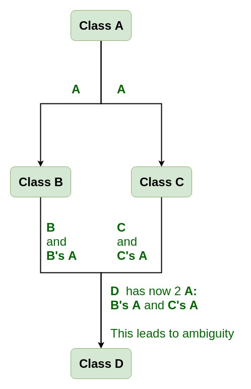

## Polymorphism

- Polymorphism in Java is a concept by which we can perform a `single action in different ways.`
- Polymorphism is derived from 2 Greek words: poly and morphs. The word "poly" means many and "morphs" means forms. So polymorphism means many forms.

### Compile Time Polymorphism:

`Compile time polymorphism or static method dispatch is a process in which a call to an overloading method is resolved at compile time rather than at run time.`

#### Why Method Overloaing is not possible by changing the return type of method?

```class Calculation{
  int sum(int a,int b)
  {
    System.out.println(a+b);
  }
  double sum(int a,int b){
    System.out.println(a+b);
   }

  public static void main(String args[]){
  Calculation obj=new Calculation();
  int result=obj.sum(30,20); //Compile Time Error returns int
  }
}
```

### Type Promotion:

`As displayed in the above diagram, byte can be promoted to short, int, long, float or double. The short datatype can be promoted to int,long,float or double. The char datatype can be promoted to int,long,float or double and so on. `

- Example of typePromotion:
- ```class Calculation{
  void sum(int a,long b){System.out.println(a+b);}
  void sum(int a,int b,int c){System.out.println(a+b+c);}

  public static void main(String args[]){
  Calculation obj=new Calculation();
  obj.sum(20,20);//now second int literal will be promoted to long
  obj.sum(20,20,20);

  }
  }
  ```

### Example of Method Overloading with TypePromotion in case ambiguity:

```
class Calculation{
  void sum(int a,long b){System.out.println("a method invoked");}
  void sum(long a,int b){System.out.println("b method invoked");}

  public static void main(String args[]){
  Calculation obj=new Calculation();
  obj.sum(20,20);//now ambiguity
  }
}
```

### Functions that cannot be overloaded:

- Function declarations that differ only in the return type. For example, the following program fails in compilation.

### Virtual Function:

- A C++ virtual function is a member function in the base class that you redefine in a derived class. It is declared using the virtual keyword.

- There is a necessity to use the single pointer to refer to all the objects of the different classes. So, we create the pointer to the base class that refers to all the derived objects. But, when base class pointer contains the address of the derived class object, always executes the base class function. This issue can only be resolved by using the 'virtual' function.

### Rules of Virtual Function:

- Virtual functions must be members of some class.
- Virtual functions cannot be static members.
- They are accessed through object pointers.
- They can be a friend of another class.
- A virtual function must be defined in the base class, even though it is not used.
- The prototypes of a virtual function of the base class and all the derived classes must be identical. If the two functions with the same name but different prototypes, C++ will consider them as the overloaded functions.
- We cannot have a virtual constructor, but we can have a virtual destructor
- Consider the situation when we don't use the virtual keyword.

### Pure Virtual Function:

- A pure virtual function is a function declared in the base class that has no definition relative to the base class.

- A class containing the pure virtual function cannot be used to declare the objects of its own, such classes are known as abstract base classes.

- Pure virtual function can be defined as:
  `virtual void display() = 0;`

* Example:

  - ```
    #include <iostream>
    using namespace std;
    class Base
    {
     public:
     virtual void show() = 0;                   // pure virtual function
    };
    class Derived : public Base
    {
     public:
     void show()
     {
     std::cout << "Derived class is derived from the base class." << std::endl;
     }
    };
    int main()
    {
     Base  bptr;
     //Base b;
     Derived d;
     bptr = &d;
     bptr->show();
     return 0;
    }

    ```

### Virtual Classes:

- Virtual base classes are used in virtual inheritance in a way of preventing multiple “instances” of a given class appearing in an inheritance hierarchy when using multiple inheritances.

### Need for Virtual Base Classes:

- Consider the situation where we have one class A .This class is A is inherited by two other classes B and C. Both these class are inherited into another in a new class D as shown in figure below.



- As we can see from the figure that data members/function of class A are inherited twice to class D. One through class B and second through class C. When any data / function member of class A is accessed by an object of class D, ambiguity arises as to which data/function member would be called? One inherited through B or the other inherited through C. This confuses compiler and it displays error.

- Virtual base classes offer a way to save space and avoid ambiguities in class hierarchies that use multiple inheritances. When a base class is specified as a virtual base, it can act as an indirect base more than once without duplication of its data members. A single copy of its data members is shared by all the base classes that use virtual base.

### Derived Class:

- The hierarchical relationship between derived class and base class is known as an `“is a” relationship.`

- For example, consider a base class, LivingBeing, which is used to create two derived classes, Plant and Animal. Plant is a LivingBeing and Animal is a LivingBeing. Both have few common features but each type can have features that are unique to its specialization and are different from the features of the base class.

- While inheriting from base class, the derived class implicitly inherits all the members (except constructors and destructors) , which it reuses as it extends and modifies the behavior of the base class.

- The derived class overrides the properties and methods of the base class so that it represents the specialized version of base class.
